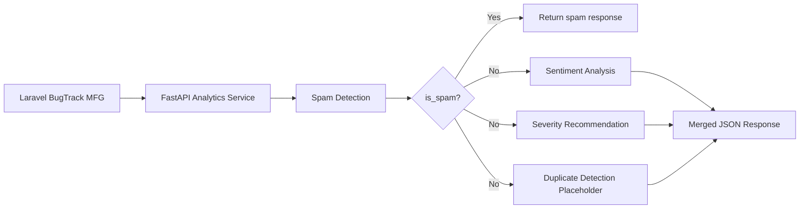
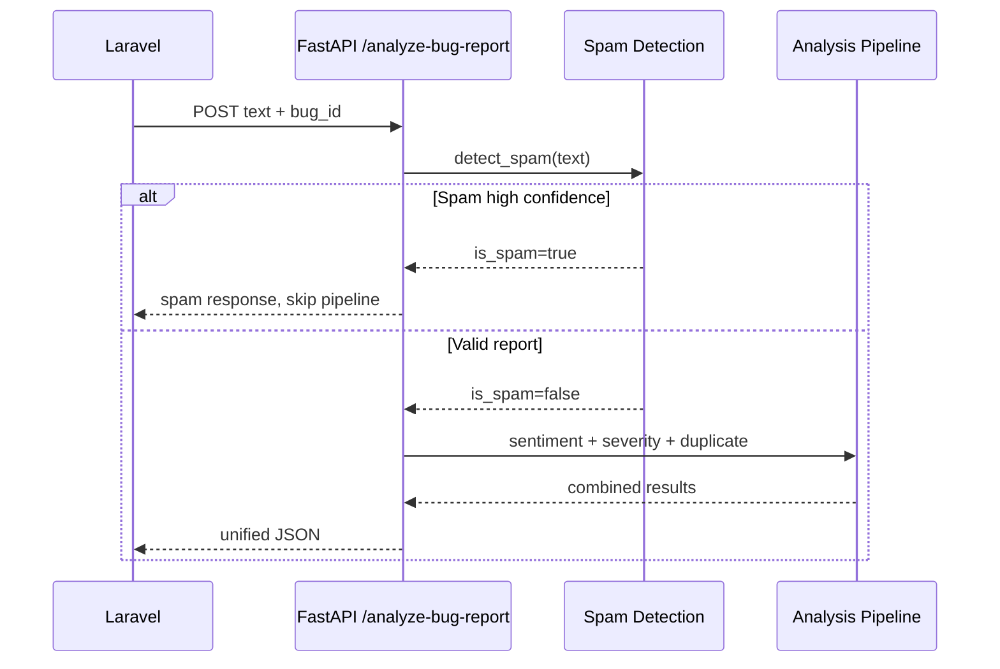
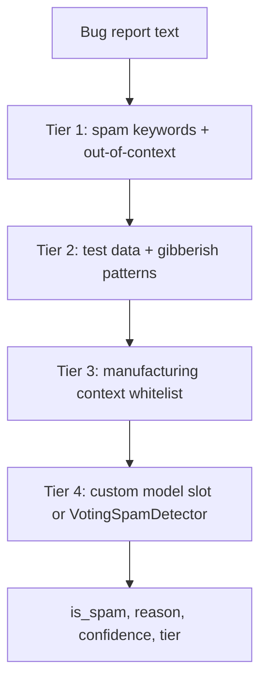

# BugTrack MFG - Analytics AI Service

FastAPI microservice untuk analisis laporan bug manufaktur. Service ini menjadi satu pintu dari Laravel untuk analisis AI ringan: spam detection, sentiment, severity recommendation, duplicate detection placeholder, dan damage cause categorization.

Gemini API sudah tidak digunakan. Spam detection memakai sistem lokal 4-tier: keyword filter, pattern/gibberish rules, manufacturing context whitelist, dan `VotingSpamDetector` dari `spam-detector-ai`.

## Why Redesigned

Arsitektur lama menjalankan spam, sentiment, dan severity secara sequential untuk semua laporan. Hasilnya boros resource karena laporan spam tetap melewati analisis lain. Arsitektur baru memakai spam-first flow: spam dicek pertama, lalu return early jika confidence tinggi. Laporan valid lanjut ke pipeline analisis lain.

## Architecture



## Request Lifecycle



## AI Pipeline



## Directory Structure

```text
analytics-service/
├── main.py
├── requirements.txt
├── README.md
├── models/
│   ├── .gitkeep
│   └── README.md
└── services/
    ├── spam_detection.py
    ├── spam_detection_improved.py
    ├── sentiment.py
    ├── severity_recommendation.py
    ├── duplicate_detection.py
    └── damage_categorization.py
```

Folder responsibilities:

- `main.py`: FastAPI app, request/response schemas, route orchestration.
- `services/`: business logic modules for each analysis capability.
- `services/spam_detection.py`: stable import facade for spam detection.
- `services/spam_detection_improved.py`: 4-tier local spam detection implementation and future custom model loading slot.
- `services/duplicate_detection.py`: placeholder for future TF-IDF/vector duplicate matching.
- `models/`: trained model artifacts, loaded once at service startup.

## FastAPI Architecture

Routes stay thin. `/analyze-bug-report` receives request, calls spam detection first, then orchestrates remaining services only for non-spam reports.

Current services:

- `detect_spam(text)`: returns `(is_spam, reason, confidence, tier)`.
- `analyze_sentiment(text)`: keyword-based sentiment.
- `recommend_severity(text)`: rule-based severity recommendation.
- `find_duplicates(text, bug_id)`: placeholder, returns empty matches.
- `categorize_damage(root_cause, repair_action)`: damage category classification.

## Laravel to FastAPI Communication

Laravel calls one endpoint for Stage 1 analysis:

```http
POST /analyze-bug-report
Content-Type: application/json
```

Request:

```json
{
  "text": "Kapasitor meledak pada PCB power supply",
  "bug_id": 123
}
```

Response:

```json
{
  "is_spam": false,
  "spam_confidence": null,
  "spam_reason": null,
  "spam_tier": "TIER4_ML",
  "sentiment_label": "negative",
  "sentiment_score": 0.8,
  "severity_recommended": "Major",
  "severity_recommendation_reason": "Detected high-impact manufacturing issue",
  "duplicates": [],
  "duplicate_count": 0,
  "processing_time_ms": 2.14
}
```

## API Endpoints

### `POST /analyze-bug-report`

Unified bug report analysis endpoint.

Behavior:

- Runs spam detection first.
- Returns early when spam confidence is high.
- Skips sentiment, severity, and duplicate detection for spam.
- Returns merged JSON for valid reports.

### `POST /analyze-damage-cause`

Categorizes damage based on root cause and repair action.

Request:

```json
{
  "root_cause": "PCB overheat",
  "repair_action": "Replace burned capacitor"
}
```

### `GET /health`

Returns service status, version, and model status.

Example:

```json
{
  "status": "healthy",
  "service": "BugTrack MFG Analytics",
  "version": "2.0.0",
  "models": {
    "spam_detection": "4-tier (rules + ML)",
    "sentiment": "keyword-based",
    "severity": "rule-based",
    "duplicate": "placeholder"
  }
}
```

## Model Loading Mechanism

`spam_detection_improved.py` prepares `CUSTOM_MODEL_PATH`:

```text
analytics-service/models/spam_detector_model.pkl
```

At startup, service checks for that file and loads it with `joblib` if present. Tier 4 uses the custom model first. If no custom model exists or prediction fails, service falls back to `VotingSpamDetector`.

Models must be loaded during startup, not per request.

## Dependency Injection Design

Current implementation keeps service calls explicit and thin. Future clean architecture expansion should move orchestration into an `AnalyzeService` class with constructor injection:

```python
class AnalyzeService:
    def __init__(self, spam_service, duplicate_service, severity_service, llm_service):
        self.spam_service = spam_service
        self.duplicate_service = duplicate_service
        self.severity_service = severity_service
        self.llm_service = llm_service
```

This allows swapping `DummySpamService`, `SklearnSpamService`, `OnnxSpamService`, or `BertSpamService` without changing route logic.

## Interfaces Overview

Future model services should expose stable interfaces:

- `BaseSpamService.predict(text)`
- `BaseDuplicateService.find(text, bug_id)`
- `BaseSeverityService.predict(text)`
- `BaseLLMService.analyze(text)`

Concrete implementations should inherit the interface and stay replaceable.

## Configuration System

Runtime values should live in environment/config modules as the service grows:

- model paths
- thresholds
- feature flags
- external AI provider settings
- vector database settings

No Gemini API key is required.

## Logging Strategy

Use centralized logging for production work. Avoid `print()` in new request-path code.

Log these events:

- startup status
- model loading
- request ID
- execution time
- prediction status
- warnings and errors

## Error Handling Strategy

Do not expose raw Python exceptions to Laravel. Future route-level exception handlers should return standardized JSON:

```json
{
  "error": {
    "code": "ANALYTICS_ERROR",
    "message": "Unable to analyze bug report"
  }
}
```

## Development Setup

Requirements:

- Python 3.8+
- FastAPI
- Uvicorn
- Pydantic
- `spam-detector-ai`

Install dependencies:

```bash
cd analytics-service
pip install -r requirements.txt
```

Run service:

```bash
python main.py
```

Service runs at:

```text
http://127.0.0.1:8001
```

## How to Add a New AI Model

1. Add trained artifact into `analytics-service/models/`.
2. Add loader logic that loads model once during startup.
3. Create service wrapper with stable method, for example `predict(text)`.
4. Keep route logic unchanged.
5. Add response fields only when Laravel needs them.
6. Document model behavior and threshold.

## Future AI Roadmap

Planned capabilities:

- custom trained spam model
- duplicate report detection with TF-IDF or embeddings
- severity classification model
- category classification model
- recommendation generation
- LLM-based report analysis
- OCR and image classification
- RAG and knowledge base search
- vector search and embedding search

Keep new capabilities modular. Add services, interfaces, and model loaders without rewriting existing endpoint flow.
